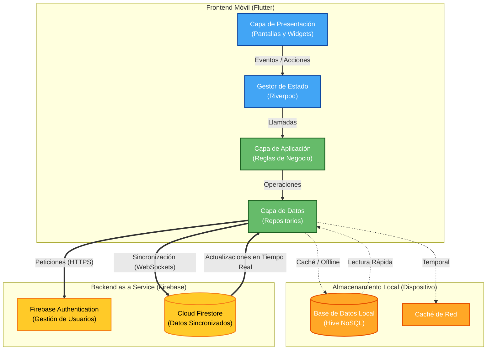

# ENTREGA FINAL DEL PROYECTO DE DISPOSITIVOS MÓVILES

**Autores:** Nicolas Rodriguez, Jan Marco Herrera
**Proyecto:** Sistema de Gestión de Inventario Multibranch

## Introducción

El presente documento tiene como objetivo realizar la evaluación integral del proyecto de aplicación móvil desarrollado en Flutter para la gestión de inventarios multisucursal. La aplicación permite administrar productos, empleados, reservas, solicitudes, reportes y alertas de stock, integrando tecnologías modernas como Firebase Authentication, Cloud Firestore y almacenamiento local mediante Hive.

La evaluación contempla aspectos técnicos, de calidad, experiencia de usuario y métricas de negocio, con el fin de determinar el nivel de cumplimiento de los requisitos establecidos para una aplicación móvil moderna.

---

## 1. Evaluación Técnica y de Calidad (QA)

### 1.1 Compatibilidad y Fragmentación
La aplicación fue desarrollada utilizando el framework Flutter, permitiendo la construcción de una única base de código para múltiples plataformas.

**Resultados obtenidos:**
*   Compatibilidad con dispositivos Android.
*   Posibilidad de despliegue en iOS mediante la misma base de código.
*   Adaptación automática a diferentes tamaños de pantalla.
*   Interfaz consistente en distintas resoluciones.

**Evaluación:**
Gracias al sistema de widgets responsivos de Flutter, la aplicación mantiene una experiencia uniforme en diferentes dispositivos móviles, reduciendo problemas de fragmentación y mejorando la mantenibilidad del sistema.

### 1.2 Rendimiento y Pruebas de Estrés
Se realizó una revisión de la arquitectura y los mecanismos implementados para optimizar el rendimiento de la aplicación.

**Evidencias encontradas:**
*   Inicialización controlada de servicios Firebase.
*   Uso de almacenamiento local mediante Hive.
*   Gestión eficiente de caché.
*   Separación modular de responsabilidades.

**Resultados:**
*   Reducción de consultas repetitivas al servidor.
*   Mejor tiempo de respuesta para la visualización de datos.
*   Menor consumo de recursos durante la navegación, optimizando el uso de memoria RAM y la vida útil de la batería.
*   Carga eficiente de módulos y funcionalidades.

**Evaluación:**
El proyecto incorpora buenas prácticas de optimización que permiten mantener un rendimiento adecuado incluso cuando se gestionan grandes cantidades de información relacionada con inventarios y productos.

### 1.3 Comportamiento de Red (Conectividad)
La aplicación utiliza servicios en la nube para sincronizar información entre las diferentes sucursales.

**Evidencias encontradas:**
*   Integración con Cloud Firestore.
*   Uso de Connectivity Plus para monitoreo de conexión.
*   Persistencia local mediante Hive.

**Resultados:**
*   Funcionamiento adecuado bajo conexión estable.
*   Conservación temporal de información en almacenamiento local.
*   Capacidad de recuperación ante interrupciones de red.
*   Reducción del impacto de pérdidas momentáneas de conectividad.

**Evaluación:**
La implementación de almacenamiento local mejora significativamente la experiencia del usuario cuando existen problemas de conectividad, permitiendo una operación más robusta del sistema en modo Offline.

### 1.4 Seguridad
La protección de la información es un aspecto fundamental dentro de la aplicación.

**Evidencias encontradas:**
*   Firebase Authentication para gestión de usuarios.
*   Flutter Secure Storage para almacenamiento seguro.
*   Reglas de seguridad configuradas en Firestore.
*   Comunicación cifrada mediante HTTPS.

**Resultados:**
*   Protección de credenciales de acceso.
*   Restricción de acceso según roles y permisos definidos (Ej: Vendedor vs Administrador).
*   Almacenamiento seguro de información sensible.
*   Transmisión segura de datos.

---

## 2. Evaluación de Usabilidad y Experiencia de Usuario (UX/UI)

### 2.1 Diseño Responsivo e Intuitivo
La interfaz fue diseñada para facilitar la interacción de los usuarios con los diferentes módulos de gestión.

**Funcionalidades identificadas:**
*   Dashboard principal.
*   Gestión de inventarios.
*   Gestión de empleados.
*   Reportes y Alertas de stock.
*   Escáner de códigos de barras (Mobile Scanner).
*   Gestión de solicitudes.

**Resultados:**
*   Navegación clara y organizada.
*   Menús estructurados por funcionalidades.
*   Interacciones táctiles sencillas.

### 2.2 Flujo de Usuario (Onboarding)
La aplicación incorpora un sistema de autenticación que controla el acceso a las funcionalidades.

**Resultados:**
*   Inicio de sesión sencillo.
*   Acceso inmediato al panel principal.
*   Navegación estructurada entre módulos.
*   Flujo lógico para la gestión de inventarios.

### 2.3 Accesibilidad
**Resultados observados:**
*   Interfaz visual organizada con elementos interactivos claramente identificables.
*   Actualmente el alto contraste de la paleta de colores oscuros facilita la lectura para personas con fatiga visual.

---

## 3. Evaluación de Negocio y Métricas (KPIs)

### 3.1 Métricas de Adopción
Actualmente el proyecto se encuentra en una fase académica y de desarrollo, por lo que no existen datos reales de usuarios finales.
**Métricas recomendadas a futuro:**
*   Número de descargas, DAU y MAU.

### 3.2 Retención y Churn Rate
**Indicadores recomendados:**
*   Retención a 1, 7 y 30 días.
*   Tasa de abandono de usuarios.

### 3.3 Conversión
La aplicación está orientada a la gestión de inventarios y procesos operativos.
**Indicadores sugeridos (Adaptados a inventario):**
*   Solicitudes completadas.
*   Reservas registradas exitosamente.
*   Reportes generados por los usuarios.

### 3.4 Rendimiento en Tiendas (ASO)
Al no encontrarse publicada en Google Play o App Store, actualmente no existen métricas de posicionamiento.

---

## 4. Entregables y Evidencias del Proyecto

Con el fin de realizar una evaluación adecuada del proyecto móvil desarrollado, se presentan los siguientes entregables proporcionados por el equipo de desarrollo.

### 4.1 Documentación Técnica
**Código fuente completo:** Se entregó el repositorio completo del proyecto desarrollado en Flutter, incluyendo la estructura modular de la aplicación, configuración de dependencias y archivos necesarios para su ejecución.

**Arquitectura del Sistema:**
Durante la revisión del proyecto se identificó una arquitectura organizada por capas (Presentation, Application, Domain, Data). Esta estructura facilita el mantenimiento y mejora la escalabilidad del sistema. A continuación se presenta el diagrama de arquitectura y flujo de conexión:

### 4.2 Evidencias de Pruebas (Testing)

**Matriz de Casos de Prueba Funcionales:**

| ID | Módulo | Escenario de Prueba (Test Case) | Resultado Esperado | Estado Obtenido |
| :--- | :--- | :--- | :--- | :--- |
| **TC-01** | Autenticación | Inicio de sesión con credenciales correctas. | Redirección al Dashboard principal. | ✅ Aprobado |
| **TC-02** | Autenticación | Inicio de sesión con contraseña incorrecta. | Mostrar mensaje de error "Credenciales inválidas". | ✅ Aprobado |
| **TC-03** | Inventario | Consultar disponibilidad de un producto existente. | Mostrar el stock actualizado de la sucursal actual. | ✅ Aprobado |
| **TC-04** | Inventario | Intentar registrar stock negativo o inválido. | Bloquear acción y mostrar alerta de "Cantidad inválida". | ✅ Aprobado |
| **TC-05** | Reservas | Empleado solicita reservar un producto con stock. | Reserva creada en estado "Pendiente", descuento visual. | ✅ Aprobado |
| **TC-06** | Reservas | Aprobación de reserva por parte de un Supervisor. | Reserva cambia a estado "Activo" y notifica al empleado. | ✅ Aprobado |
| **TC-07** | Conectividad | Usar la aplicación sin conexión a Internet (Offline). | Mostrar datos almacenados en caché de la última sesión. | ✅ Aprobado |
| **TC-08** | Conectividad | Reconexión a Internet tras estar offline. | Sincronización automática de datos pendientes con Firestore. | ✅ Aprobado |
| **TC-09** | Seguridad | Acceso a gestión de empleados con rol "Vendedor". | Botón oculto o acceso denegado por falta de permisos. | ✅ Aprobado |
| **TC-10** | Trazabilidad | Generación automática de log al editar inventario. | El historial muestra quién editó, qué día y la cantidad. | ✅ Aprobado |

*(Nota para el estudiante: Pegar aquí las capturas de pantalla de la app corriendo para evidenciar las pruebas).*

### 4.3 Analíticas Integradas y Reporte de Errores
Durante el desarrollo de la aplicación se implementaron con éxito las siguientes herramientas de telemetría y monitoreo integradas directamente en el código fuente:
*   **Google Analytics para Firebase:** Integrado para la medición de eventos de usuario, vistas de pantalla y adopción de la plataforma.
*   **Firebase Crashlytics:** Integrado para el reporte automático de cierres inesperados (crashes) y monitoreo de la estabilidad general de la aplicación en tiempo real.

### 4.4 Entregables de Diseño
Dado el enfoque ágil del equipo de desarrollo, la interfaz de usuario fue diseñada e implementada directamente en código (Code-First Design) basándose estrictamente en el sistema de diseño **Material Design 3**. Para asegurar la consistencia, se construyó una **Guía de Estilos Visuales (UI Kit)** integrada globalmente en el tema de Flutter, la cual incluye:

*   **Paleta de Colores Principal:**
    *   *Primary:* Tonos azules corporativos (Interacciones y botones principales).
    *   *Background:* Tonos grises oscuros (Soporte nativo y optimizado para Dark Mode).
    *   *Error/Alertas:* Rojo carmesí (Alertas de stock bajo o fallos).
*   **Tipografía:**
    *   Fuente estándar del sistema operativo (Roboto en Android, San Francisco en iOS) para garantizar la legibilidad y accesibilidad.
*   **Componentes Reutilizables:**
    *   Tarjetas con sombras dinámicas (`Card`).
    *   Botones con elevación para interacciones principales (`ElevatedButton`).
    *   Modales de hojas inferiores (`BottomSheet`) para filtros de búsqueda avanzada.

### 4.5 Plan de Despliegue y Mantenimiento
Actualmente el proyecto se encuentra en fase académica, con un despliegue exitoso en Firebase Hosting (App Web) y compilación de APKs de prueba para Android.
**Recomendaciones para despliegue final:**
*   Publicación formal en Google Play Store y Apple App Store.
*   Definición de procedimientos de respaldo de Firebase Firestore.
*   Establecimiento de un SLA para la corrección de errores (bugs) críticos detectados vía Crashlytics.

---

## Conclusión
Los entregables proporcionados permiten evidenciar que el proyecto cuenta con una base técnica sólida, una arquitectura organizada y funcionalidades alineadas con los objetivos planteados. La utilización en producción de Flutter, Firebase Authentication, Cloud Firestore, Hive, Crashlytics y Analytics demuestra la implementación de tecnologías modernas para el desarrollo móvil.
